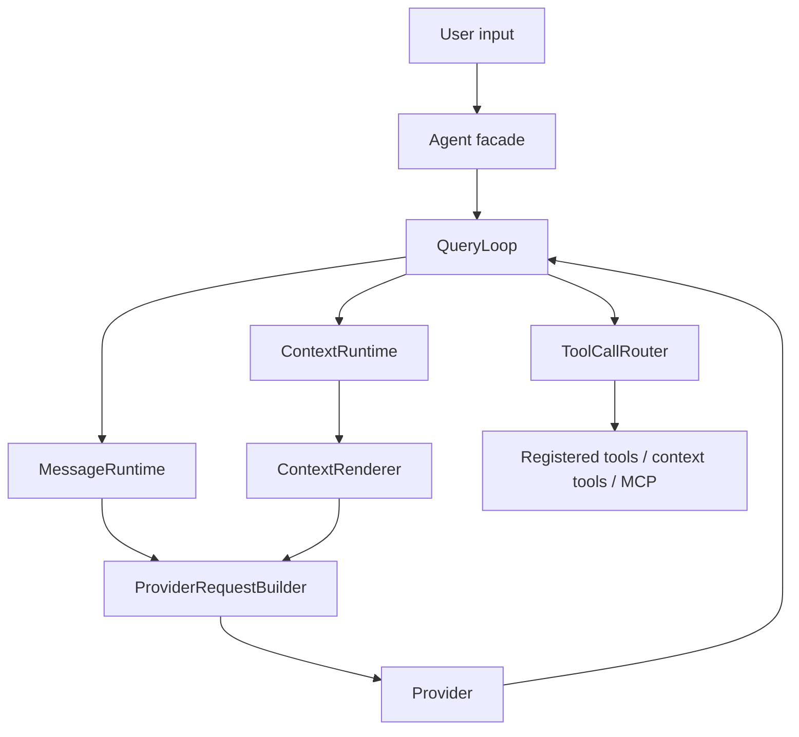

# Architecture

Source map: `docs/design/sdk-architecture.md`, `src/agentos/runtime/query_loop.py`,
`src/agentos/context/renderer.py`, `src/agentos/messages/runtime.py`,
`src/agentos/capabilities/router.py`, and `src/agentos/providers/base.py`.

Production boundaries added by the hardening pass:

- `runtime/retry.py` provides provider retry and circuit breaker policy.
- `channels/rate_limit.py` provides channel-layer sliding-window limiting.
- `observability/logging.py` provides opt-in JSON logging.
- `multi/reconciler.py` and `multi/redis_continuation.py` provide distributed
  multi-agent notification recovery boundaries.
