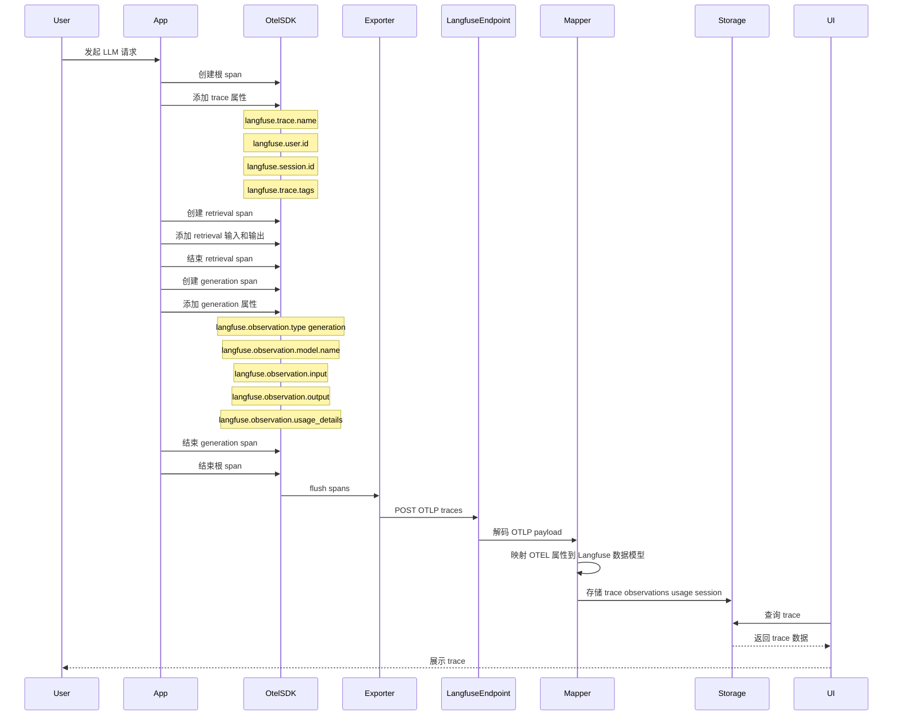
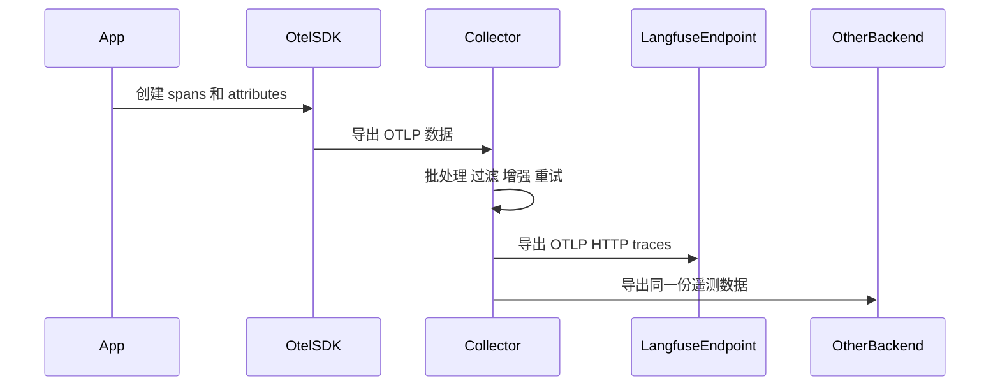

# Langfuse OTEL 交互时序

本文说明应用如何通过 OpenTelemetry 将 trace 发送到 Langfuse。
Mermaid 图使用较保守的语法，便于在常见 IDE Markdown 预览中渲染。

## 直连 OTEL 导出



## 经过 Collector 导出



## Endpoint 和认证

本地自托管 Langfuse 的 OTLP endpoint：

```text
http://localhost:3000/api/public/otel
```

如果使用 trace 专用的 OTLP HTTP exporter：

```text
http://localhost:3000/api/public/otel/v1/traces
```

Langfuse 对 OTLP ingest 使用 Basic Auth：

```bash
echo -n "$LANGFUSE_PUBLIC_KEY:$LANGFUSE_SECRET_KEY" | base64
```

生成的值放到请求头里：

```text
Authorization: Basic <base64 public key and secret key>
x-langfuse-ingestion-version: 4
```

## 关键属性

如果希望在 Langfuse 中稳定过滤和聚合，trace 级别属性应该传播到同一个 trace
里的所有 spans 上。

| 用途 | 属性 |
| --- | --- |
| Trace 名称 | `langfuse.trace.name` |
| 用户分组 | `langfuse.user.id` |
| Session 分组 | `langfuse.session.id` |
| Tags | `langfuse.trace.tags` |
| Trace 元数据 | `langfuse.trace.metadata.*` |
| Observation 类型 | `langfuse.observation.type` |
| Observation 输入 | `langfuse.observation.input` |
| Observation 输出 | `langfuse.observation.output` |
| 模型名称 | `langfuse.observation.model.name` |
| Token 用量 | `langfuse.observation.usage_details` |

## 本地冒烟测试

本项目里的本地冒烟测试：

```bash
uv run --with opentelemetry-sdk --with opentelemetry-exporter-otlp-proto-http python scripts/langfuse_otel_smoke_test.py
```

预期在 Langfuse 中看到的 trace 名称：

```text
otel-smoke-test
```

## 心智模型

OTEL 不是解析日志。应用或 instrumentation 在运行时创建结构化 spans，
挂载 attributes，然后用 OTLP 导出。Langfuse 收到后，把这些 span
attributes 映射成自己的 trace、observation、generation、session 和 usage 模型。

```text
App
  -> OpenTelemetry spans
  -> OTLP HTTP exporter
  -> Langfuse OTLP endpoint
  -> Langfuse trace UI
```

## 参考

- https://langfuse.com/integrations/native/opentelemetry
- https://opentelemetry.io/docs/concepts/signals/traces/
